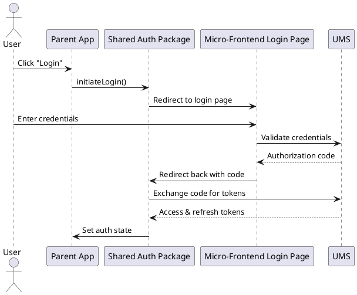
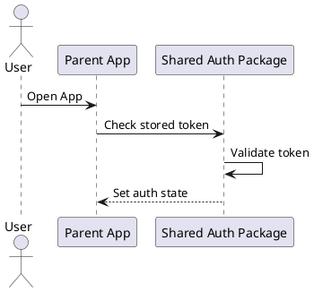
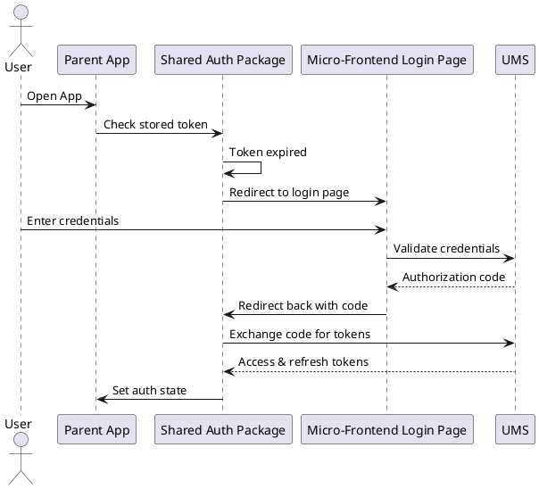
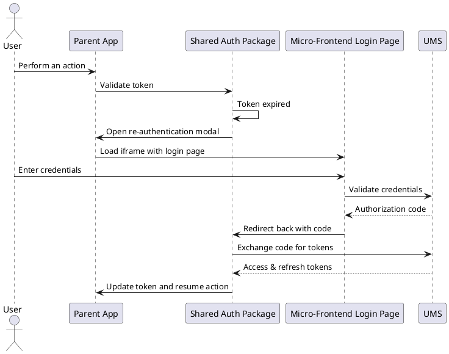
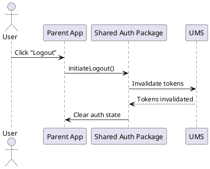
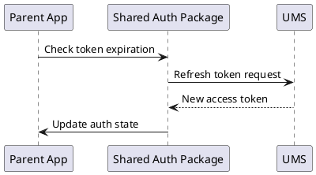
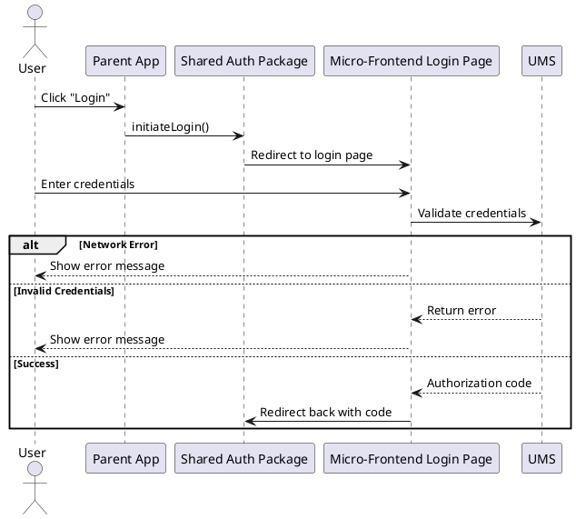

replace microfrontend with subdomain login page
fix the lucid chart diagram to include okta/google/auth0 etc
- the token obtained from these providers will be sent to UMS, and UMS will give a fresh token for them
identify which props should be available for the config service 

fix those diagrams where validation is happening within the shared package. validation can only happen with the help of the backend.

check iframe code. not needed probably

when we redirect back to teh parent app, we should inform the parent app how the user logged in (google okta etc). so that when user logs out, we clear tokens correctly.


---

components services and modules

```
@startuml
actor User
participant "Parent App" as Parent
participant "Shared Auth Package" as AuthPackage
participant "OmniLogin Page" as OmniLogin
participant "ConfigService" as ConfigService
participant "UMS" as UMS

User -> Parent: Click "Login"
Parent -> AuthPackage: initiateLogin()
AuthPackage -> OmniLogin: Redirect to OmniLogin page
OmniLogin -> ConfigService: Fetch Configurations (client_id)
ConfigService --> OmniLogin: Configurations (authEndpoint, redirectUri, etc.)
User -> OmniLogin: Enter credentials
OmniLogin -> UMS: Validate credentials
UMS --> OmniLogin: Access & refresh tokens
OmniLogin -> AuthPackage: Send tokens
AuthPackage -> Parent: Set auth state
@enduml


---


```
# User flows
---
## Sign in methods
- UMS
- Google sign in
- okta (?)
- Auth0 (where it is necessary)

# Flows

## UMS
#### First time login

- This flow can happen in a separate window. iFrame is not needed as user is not in the middle of a process. 
```
/login OR /verify-otp
/token -> exchange code with token


```

#### User already logged in 
- Token valid
	- Short circuit the login logic and go ahead
- Token invalid
	- In case user was in the middle of an operation, we must not interrupt the user flow and maintain the app's state. this means we can replace the current URL and redirect to the login page, as it will result in loss of app state
	- Solution: Ideally we should open the login page in a modal with an iframe or open a mini browser window where the login flow happens, and we will have to communicate with this window to complete the auth

#### Errors during login
(the messages and option to retry has to be configurable by the parent app)
- Network error during login
	- retry button + error message
- invalid creds
	- error message and retry button
- popup/ opening of mini browser window blocked
	- the parent app should notify the user to allow popup
--- 


Here’s a comprehensive list of **user flows** in the authentication process and their corresponding **flow diagrams**.

We’ll cover:

1. **User Flows List**
    
    - First-time login
    - Returning user with valid token
    - Token expired before operation
    - Token expired during operation
    - Logout flow
    - Silent token refresh
    - Error handling flow
2. **Flow Diagrams**
    
    - Sequence diagrams for each flow to visualize the steps involved.

---

## ✅ **1. User Flows List**

|**Flow Name**|**Description**|
|---|---|
|**First-Time Login**|User signs in for the first time and receives access/refresh tokens.|
|**Returning User (Valid Token)**|User opens the app and has a valid token.|
|**Token Expired (Before Operation)**|User’s token expires before any operation is performed, requiring re-authentication.|
|**Token Expired (During Operation)**|Token expires while the user is performing an action (e.g., submitting a form).|
|**Logout Flow**|User logs out, and tokens are invalidated.|
|**Silent Token Refresh**|The app automatically refreshes the access token before it expires.|
|**Error Handling Flow**|Handling errors like network issues, invalid credentials, and session revocation.|

---

## 🖼️ **2. Flow Diagrams**

### 📄 **Flow 1: First-Time Login**

**Description:**  
User initiates the login process, completes authentication, and receives an access token and refresh token.



alternative provider:

![[Pasted image 20250402113327.png]]

---

### 📄 **Flow 2: Returning User (Valid Token)**

**Description:**  
User has a valid token stored from a previous session. The app skips the login flow and sets the authentication state.



---

### 📄 **Flow 3: Token Expired (Before Operation)**

**Description:**  
User’s token has expired before they initiate an operation. The app prompts for re-authentication.



---

### 📄 **Flow 4: Token Expired (During Operation)**

**Description:**  
Token expires while the user is in the middle of an operation (e.g., form submission). The app opens a modal or iframe to re-authenticate without losing the user’s progress.



```jsx
const handleTokenExpiryDuringOperation = async (operation) => {
    if (authPackage.isTokenExpired()) {
        console.log("Token expired. Opening re-authentication modal...");

        // Open iframe for re-authentication
        const iframe = document.createElement("iframe");
        iframe.src = "https://login.wework.co.in"; // URL of the micro-frontend login page
        iframe.style.display = "none";
        document.body.appendChild(iframe);

        // Listen for postMessage from the iframe
        const messageHandler = async (event) => {
            if (event.origin !== "https://login.wework.co.in") {
                console.warn("Ignoring message from untrusted origin:", event.origin);
                return;
            }

            if (event.data.type === "authCodeResponse" && event.data.authCode) {
                console.log("Received auth code from iframe...");

                const tokens = await authPackage.exchangeCodeForTokens({
                    authCode: event.data.authCode,
                    redirectUri: "https://parentapp.com/callback",
                    clientId: "frontend-client-id"
                });

                authPackage.setAuthState(tokens); // Save tokens and update auth state

                // Remove the iframe and clean up event listener
                document.body.removeChild(iframe);
                window.removeEventListener("message", messageHandler);

                // Resume the user operation
                operation();
            }
        };

        window.addEventListener("message", messageHandler);

        // Notify iframe to start the auth flow
        iframe.onload = () => {
            iframe.contentWindow.postMessage({ type: "requestAuthCode" }, "https://login.wework.co.in");
        };
    } else {
        operation(); // Token is valid, proceed with the operation
    }
};
```

---

### 📄 **Flow 5: Logout Flow**

**Description:**  
User logs out, and the app clears tokens and resets the authentication state.



---

### 📄 **Flow 6: Silent Token Refresh**

**Description:**  
The app automatically refreshes the access token in the background before it expires.



---

### 📄 **Flow 7: Error Handling Flow**

**Description:**  
Handling various error cases during authentication, such as network errors or invalid credentials.



---

